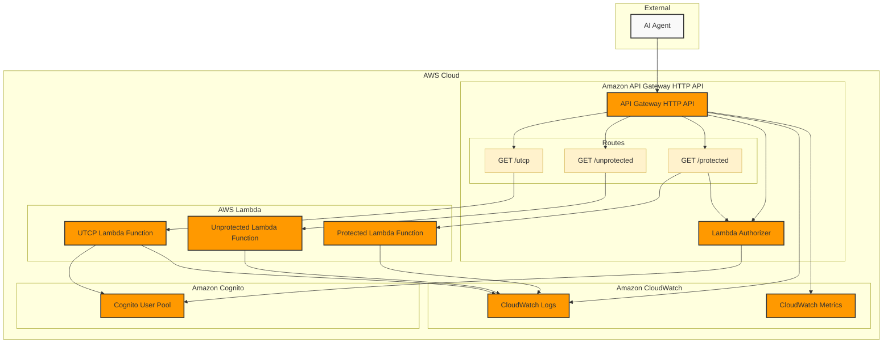

# Transform your (Serverless) APIs into agent tools with UTCP - DEMO

This sample demonstrates how enterprise customers can enable AI agents to securely discover and interact with their existing APIs, without breaking changes and complex additional server infrastructure, using the [Universal Tool Calling Protocol (UTCP)](https://github.com/universal-tool-calling-protocol/).

## What is UTCP?

[UTCP (Universal Tool Calling Protocol)](https://github.com/universal-tool-calling-protocol/) is a standardized protocol that makes APIs discoverable and callable by AI agents. It provides:

- **Zero API Changes**: Your existing endpoints remain unchanged
- **AI Agent Discoverability**: Agents can automatically discover and understand API capabilities
- **Standardized Interface**: Uniform JSON Schema format compatible with all AI frameworks
- **Authentication Abstraction**: Clear auth requirements in standard format
- **Enterprise Security**: Supports JWT, API keys, OAuth2, and other auth methods

## Architecture

This pattern creates:
- Amazon API Gateway HTTP API with three endpoints:
  - `/unprotected` - Public endpoint (no authentication)
  - `/protected` - Secured with Cognito JWT authentication
  - `/utcp` - UTCP discovery endpoint (public endpoint with tiered discovery logic)
- AWS Lambda functions for each endpoint
- Amazon Cognito User Pool for authentication
- Dynamic UTCP manual generation using the official `@utcp/sdk` simply using OpenAPI specifications

### Architecture Diagram



### Tiered Discovery Flow


## Enterprise Benefits

1. **Progressive AI Integration**: AI agents unlock more capabilities as they authenticate
2. **Self-Documenting APIs**: The `/utcp` endpoint serves as both documentation and executable specification
3. **Framework Agnostic**: Works with Claude, GPT, Bedrock, and other AI platforms
4. **Future-Proof**: Supports multiple transport mechanisms (HTTP, WebSocket, CLI, gRPC)
5. **Zero Breaking Changes**: Existing API clients continue to work unchanged
6. **Layered Security**: Multiple levels of protection (discovery + execution)

Important: this application uses various AWS services and there are costs associated with these services after the Free Tier usage - please see the [AWS Pricing page](https://aws.amazon.com/pricing/) for details. You are responsible for any AWS costs incurred. No warranty is implied in this example.

## Requirements

* [Create an AWS account](https://portal.aws.amazon.com/gp/aws/developer/registration/index.html) if you do not already have one and log in. The IAM user that you use must have sufficient permissions to make necessary AWS service calls and manage AWS resources.
* [AWS CLI](https://docs.aws.amazon.com/cli/latest/userguide/install-cliv2.html) installed and configured
* [Git Installed](https://git-scm.com/book/en/v2/Getting-Started-Installing-Git)
* [AWS Cloud Development Kit](https://docs.aws.amazon.com/cdk/v2/guide/getting_started.html) (AWS CDK) installed

## Deployment Instructions

1. Create a new directory, navigate to that directory in a terminal and clone the GitHub repository:
    ```bash 
    git clone https://github.com/Robobc/Transform-your-APIs-into-agent-tools-with-UTCP.git
    ```

1. Change directory to the pattern directory:
    ```bash
    cd Transform-your-APIs-into-agent-tools-with-UTCP
    ```

1. Install dependencies
    ```bash
    npm install
    ```

1. Deploy the stack to your default AWS account and region. The output of this command should give you the HTTP API URL.
    ```bash
    cdk deploy
    ```

1. Note the outputs from the CDK deployment process. These contain the resource names and/or ARNs which are used for testing.

## How it works

This pattern demonstrates enterprise-grade AI agent integration with **tiered discovery** using **OpenAPI-driven UTCP generation**:

### Core Components

1. **OpenAPI Specifications**: API endpoints are defined using industry-standard OpenAPI 3.0 specifications (embedded in Lambda)
2. **Dynamic UTCP Generation**: The `/utcp` endpoint uses the official UTCP SDK's `OpenApiConverter` to transform OpenAPI specs into UTCP tool definitions at runtime
3. **Tiered API Discovery**: AI agents call the `/utcp` endpoint to discover available tools based on their authentication status
4. **Progressive Authentication**: Unauthenticated agents discover public tools; authenticated agents discover all tools
5. **Tool Execution**: Agents call the actual API endpoints using the discovered tool definitions
6. **Standardized Response**: All interactions follow UTCP protocol standards

### API Endpoints

- **UTCP endpoint** (`/utcp`): **Public endpoint with tiered discovery logic**
  - No authentication required to access
  - Returns different tool sets based on JWT presence
  - Implements progressive disclosure security model
- **Unprotected endpoint** (`/unprotected`): Demonstrates public API integration
- **Protected endpoint** (`/protected`): Shows secure API access with JWT authentication

### Tiered Discovery Model

The UTCP endpoint implements progressive disclosure:

| Authentication Status | Tools Returned | Security Model |
|----------------------|----------------|----------------|
| **Unauthenticated** | 1 tool (`get_unprotected_data`) | Public tools only |
| **JWT Authenticated** | 2 tools (public + `get_protected_data`) | Full access |

### OpenAPI-Driven Architecture Benefits:

- **Single Source of Truth**: API definitions are maintained in OpenAPI format
- **Industry Standard**: Uses OpenAPI 3.0 specifications for API documentation
- **Automatic UTCP Generation**: Tools are generated dynamically from OpenAPI specs
- **Easy Maintenance**: Update OpenAPI specs, UTCP tools update automatically
- **Better Tooling**: Supports Swagger UI, validation, and other OpenAPI tools
- **Scalable**: Easy to add new endpoints by updating OpenAPI specifications

### Implementation Details:

- **Embedded OpenAPI Specs**: Specifications are embedded directly in the Lambda function for optimal performance and reduced latency
- **Official UTCP SDK**: Uses the `@utcp/sdk` package for reliable OpenAPI to UTCP conversion
- **Runtime Generation**: UTCP tools are generated dynamically based on authentication status

Each API endpoint is automatically described in the UTCP manual with proper authentication requirements, input/output schemas, and execution details derived from the OpenAPI specifications.

## Testing

### Pre-requisites
1. Export the variables with the outputs of your stack.
   ```bash
     # Get the stack name (adjust the filter if your stack has a different naming pattern)
     export STACK_NAME=$(aws cloudformation list-stacks --stack-status-filter CREATE_COMPLETE UPDATE_COMPLETE --query 'StackSummaries[?contains(StackName, `Transform`) || contains(StackName, `Utcp`) || contains(StackName, `Api`)].StackName' --output text)
     
     # Extract values from CloudFormation stack outputs
     export API_URL=$(aws cloudformation describe-stacks --stack-name $STACK_NAME --query 'Stacks[0].Outputs[?OutputKey==`HttpApiURL`].OutputValue' --output text)
     export POOL_ID=$(aws cloudformation describe-stacks --stack-name $STACK_NAME --query 'Stacks[0].Outputs[?OutputKey==`UserPoolId`].OutputValue' --output text)
     export CLIENT_ID=$(aws cloudformation describe-stacks --stack-name $STACK_NAME --query 'Stacks[0].Outputs[?OutputKey==`UserPoolClientId`].OutputValue' --output text)
     
     # Export the AWS region (needed for Python script)
     export AWS_DEFAULT_REGION=$(aws configure get region)

     echo "API_URL: $API_URL"
     echo "POOL_ID: $POOL_ID"
     echo "CLIENT_ID: $CLIENT_ID"
     echo "AWS_DEFAULT_REGION: $AWS_DEFAULT_REGION"
   ```
2. Export the variables for the fake user to be created
   ```bash
     export EMAIL="fake@example.com"                                
     export PASSWORD="S3cuRe#FaKE*"
   ```

### Individual Endpoint Testing

**Unprotected endpoint**
To test the unprotected endpoint, send a HTTP GET request to the unprotected endpoint. The response should show `Hello Unprotected Space`.
```bash
curl ${API_URL}/unprotected
```

**Protected endpoint**
To test the protected endpoint:

First sign-up the fake user against Cognito.
```bash
 aws cognito-idp sign-up \
 --client-id ${CLIENT_ID} \
 --username ${EMAIL} \
 --password ${PASSWORD}
```
Confirm the fake user to Cognito
 ```bash
 aws cognito-idp admin-confirm-sign-up \
 --user-pool-id ${POOL_ID} \
 --username ${EMAIL}
```
Then you send the authentication data and Cognito will return the token.
 ```bash
TOKEN=$(aws cognito-idp initiate-auth \
 --client-id ${CLIENT_ID} \
 --auth-flow USER_PASSWORD_AUTH \
 --auth-parameters USERNAME=${EMAIL},PASSWORD=${PASSWORD} \
 --query 'AuthenticationResult.AccessToken' \
 --output text)
```
Send an HTTP GET request to the API Gateway with the JWT token, which will verify the token and call the protected Lambda function.
 ```bash
curl -H "Authorization: ${TOKEN}" ${API_URL}/protected
```

**UTCP endpoint (Tiered Discovery)**
To test the UTCP tiered discovery functionality:

Test without authentication (should return only public tools):
```bash
curl ${API_URL}/utcp
```

Test with authentication (should return all tools):
```bash
curl -H "Authorization: ${TOKEN}" ${API_URL}/utcp
```

The authenticated request returns a UTCP manual describing all available tools:
```json
{
  "version": "0.1.1",
  "tools": [
    {
      "name": "get_unprotected_data",
      "description": "Get data from the unprotected endpoint",
      "tags": ["public", "unprotected", "api"],
      "tool_provider": {
        "provider_type": "http",
        "http_method": "GET",
        "url": "https://your-api.amazonaws.com/unprotected"
      }
    },
    {
      "name": "get_protected_data",
      "description": "Get data from the protected endpoint",
      "tags": ["protected", "jwt", "auth", "api"],
      "tool_provider": {
        "provider_type": "http",
        "http_method": "GET",
        "url": "https://your-api.amazonaws.com/protected",
        "auth": {
          "auth_type": "api_key",
          "var_name": "Authorization",
          "location": "header"
        }
      }
    }
  ]
}
```

*Note: This is a simplified example. The actual response includes full JSON Schema definitions for inputs and outputs. For complete UTCP specification details, see the [Universal Tool Calling Protocol repository](https://github.com/universal-tool-calling-protocol/).*

## AI Agent Integration

**Testing with Claude via Amazon Bedrock**

A sample Python script (`test_claude_bedrock.py`) demonstrates how AI agents can:
1. Authenticate with Cognito
2. Discover tools via the `/utcp` endpoint
3. Execute tools using the discovered definitions
4. Handle responses in a conversational manner

To run the AI agent test:
```bash
pip install boto3 requests
python test_claude_bedrock.py
```

**Testing Tiered Discovery**

An enhanced test script (`test_tiered_discovery.py`) demonstrates the complete tiered discovery model:
1. **Unauthenticated Discovery**: Shows only public tools available without authentication
2. **Authenticated Discovery**: Shows all tools (public + protected) available with JWT authentication
3. **Tool Execution Testing**: Tests both public and protected tools with and without authentication
4. **Security Validation**: Confirms protected tools are properly secured

To run the tiered discovery test:
```bash
pip install boto3 requests
python test_tiered_discovery.py
```

**Expected Results:**
- Unauthenticated agents discover 1 tool (public only)
- Authenticated agents discover 2 tools (public + protected)
- Public tools work with or without authentication
- Protected tools require authentication and return 401 without it
- This enables progressive disclosure and layered security for AI agents

The scripts show how enterprise customers can enable AI agents to securely interact with their APIs without manual configuration or hardcoded endpoints.
 

## Cleanup
 
Run the given command to delete the resources that were created. It might take some time for the CloudFormation stack to get deleted.
```bash
cdk destroy
```

## Enterprise Considerations

**Security**
- **Tiered Discovery**: UTCP endpoint is public but implements progressive disclosure based on authentication
- **Tool Execution Security**: Each tool maintains its original API security requirements
- **No Information Leakage**: Protected tools are completely hidden from unauthenticated agents
- **JWT Verification**: Secure token validation using AWS Cognito

**Scalability**
- **Dynamic Tool Generation**: Add new tools by updating OpenAPI specifications
- **Multi-Framework Support**: Compatible with Claude, GPT, Bedrock, and other AI platforms
- **API Management Integration**: Works with existing API Gateway monitoring and logging
- **Horizontal Scaling**: Lambda functions scale automatically with demand

**Compliance**
- **Audit Trails**: Complete request logging through API Gateway CloudWatch integration
- **Enterprise Authentication**: Supports Cognito, IAM, and other enterprise auth patterns
- **API Contract Stability**: No changes to existing API contracts or SLAs
- **Data Governance**: Clear separation between public and protected data access

## References

- Original pattern: [Amazon API Gateway HTTP API with Cognito JWT and AWS Lambda integration](https://github.com/aws-samples/serverless-patterns/tree/main/apigw-http-api-cognito-lambda-cdk)
- UTCP Specification: [Universal Tool Calling Protocol](https://github.com/universal-tool-calling-protocol/)
- Learn more at Serverless Land Patterns: [https://serverlessland.com/patterns/apigw-http-api-cognito-lambda-cdk](https://serverlessland.com/patterns/apigw-http-api-cognito-lambda-cdk)

----
SPDX-License-Identifier: MIT-0
